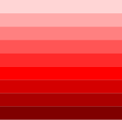
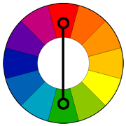

# Colours

Many people use terms like “hue” and “color” or “tint” and “shade” interchangeably, but the terms have distinctly
different meanings. Color is a very general term used to describe every hue, tint, tone, or shade we can see.

## Hue

Hue refers to the dominant color family.

Hue refers to the origin of the colors we can see. Primary and Secondary colors (Yellow, Orange, Red, Violet, Blue, and
Green) are considered hues; however, tertiary colors (mixed colors where neither color is dominant) would also be
considered hues

## Tone

Tone is a hue or mixture of pure colors to which only pure gray is added (equal amounts of black and white). Adding gray
to a color will make the intensity much duller. Beware of mixing too much gray into a hue as it can become over-dulled
and virtually impossible to restore the brilliance.

## Tints

A tint is where an artist adds a colour to white to create a lighter version of the colour. An example of a tint is
pink. Pink is a tint created by adding white to red.

Tint refers to any hue or mixture of pure colors to which white is added. Pastel colors are generally tinted colors.
Tinted color remains the same color, but it is paler than the original. When mixing a tint, always begin with white
paint and gradually mix in small amounts of color until you’ve achieved the tint you wlant.

## Shades

A shade is where an artist adds black to a colour to darken it down. A tone is where an artist adds grey to a colour

Shade is a hue or mixture of pure colors to which only black is added. It contains no white or gray. Shade darkens the
color, but the hue remains the same. When mixing a shade, begin with the color itself then add black one drop at a time.

And many do consider black to be a color, because you combine other pigments to create it on paper. But in a technical
sense, black and white are not colors, they're shades.

# Primary

The primary colours are Red, Blue and Yellow they can't be created by mixing any other colours, they are considered the
root of every other colour.

Mix equal amounts of red, blue and yellow to get black.

# Secondary

The secondary colors are Orange, Purple and Green. ...

a color formed by mixing two primary colors in equal or equivalent quantities.

# Tertiary

Tertiary colors are the six 'in-between' colors.15 Feb 2017 Six Tertiary Colors (Ts): Red-Orange, Yellow-Orange,
Yellow-Green, Blue-Green, Blue-Violet, Red-Violet, which are formed by mixing a primary with a secondary.

# Colour Schemes / Colour Harmonies

"
In color theory, a color scheme is the choice of colors used in various artistic and design contexts. For example, the "
Achromatic" use of a white background with black text is an example of a basic and commonly default color scheme in web
design.

Color schemes are used to create style and appeal. Colors that create an aesthetic feeling when used together will
commonly accompany each other in color schemes. A basic color scheme will use two colors that look appealing together.
"
[2](https://en.wikipedia.org/wiki/Color_scheme)

Color schemes are often described in terms of logical combinations of colors on a color wheel. Different types of
schemes, like monochromatic or complementary, are used. [2](https://en.wikipedia.org/wiki/Color_scheme)

## Monochromatic

Monochromatic colors are all the colors (tints, tones, and shades) of a single hue. Monochromatic color schemes are
derived from a single base hue, and extended using its shades, tones and tints (that is, a hue modified by the addition
of black, gray (black + white) and white. As a result, the energy is more subtle and peaceful due to a lack of contrast
of hue.[2](https://en.wikipedia.org/wiki/Color_scheme)

"Monochromatic An artist may decide to create a piece of artwork which is monochromatic. This means that the artist uses
tints, shades and tones of a single colour."

"The term achromatic can be confused with monochromatic. Achromatic means only the neutral colors are used in
decorating. These neutral colors are black, white, and gray. A monochromatic color scheme, however, means that designers
use varying shades of one color."

"Monochromatic color schemes are easy to create because they use only one color."

## Complementary

For the mixing of colored light, Newton's color wheel is often used to describe complementary colors, which are colors
that cancel each other's hue to produce an achromatic (white, gray or black) light mixture. Newton offered as a
conjecture that colors exactly opposite one another on the hue circle cancel out each other's hue; this concept was
demonstrated more thoroughly in the 19th century. [2](https://en.wikipedia.org/wiki/Color_scheme)

" Colors that are opposite each other on the color wheel are considered to be complementary colors (example: red and
green). The high contrast of complementary colors creates a vibrant look especially when used at full saturation. This
color scheme must be managed well so it is not jarring. Complementary colors are tricky to use in large doses, but work
well when you want something to stand out. Complementary colors are really bad for
text." [4](https://www.tigercolor.com/color-lab/color-theory/color-harmonies.htm)

## Harmonious Colours

A harmonious colour is one that sits next to another on the colour wheel or very close to it for example, red is near
rust, which is near terracotta. It's very easy to create a balanced, unified scheme that is pleasing to the eye using
harmonious colours. [3](https://www.bbc.co.uk/homes/design/colour_scheme.shtml)

Harmonious color schemes are based on balance and are used in places that need to feel restful, such as hospitals or
meditation centers. Harmonious color schemes are often inspired by nature. They tend to use a gentle, natural and often
neutral color palette.

Nature can provide guidance for this color scheme. Think about a forest, desert, beach or mountain. The colors you
choose should be in the same chromatic range. Any of the color schemes mentioned above can be used to create a
harmonious color scheme. The key ingredient is balance.

For example:

- Monochromatic scheme in shades of Blue
- Monochromatic scheme in shades of Green
- Muted Yellow with Muted Red Yellow,
- Yellow Orange and Orange—all in muted tones

[4](https://chromaflo.com/color-theory/harmonious-color-schemes-and-mood/)

# Psychological

But the psychology of color dates back thousands of years, to Egyptians who studied their effect on mood and used them
to accomplish holistic benefits

## Red

Color red is passionate, warm, vibrant. It is the color of sexuality, romance, and lust. Red is energizing. It can
increase a person’s heart rate. It is considered a color that, compared to the rest of the colors, provokes the
strongest emotions. Red is considered powerful. The fastest and the most luxurious cars in the world are most often
painted in red; people that are famous and important are usually given the red carpet treatment; women that wear red are
considered much more attractive and passionate than women that don’t favor this shade. Color red makes people feel
dominant and powerful, and it can boost their self esteem. Red is a bold color, which makes one stand out from the crowd
and influence the way others see them. The red personality type People who favor color red are extroverted, open,
enthusiastic. They live their life to the fullest.

They are optimistic, strong, confident. They are not afraid to stand up for themselves. They are not easily scared and
they can be quite competitive.

Reds are known to be impulsive. Due to their passionate nature, they take things personally and rarely back down. It is
hard for them to apologize and admit they are wrong. They are natural leaders and a big inspiration to everyone around
them. They have a capacity to recognize the important things in both personal and professional life. They gain respect
by knowing how to set boundaries.

It is easy to notice reds when they enter the room. The are charming, charismatic, radiant. Even though, it is not
always easy to be around them. They never give up control and they like to be in charge all the time. When they don’t
get what they want, they can be aggressive. In fact, they can often exhibit violent temper. Despite the fact that they
calm down pretty quickly after the outburst, people around them find it hard to overlook frequent meltdowns.

Negative characteristics of color red While red is a passionate color, it is also linked to revenge and anger. People
often get red in the face when they are angry, which is why red is associated with anger across many cultures. Red color
stands for violence and danger because of its resemblance to the color of human blood, and is also associated with
warnings. Due to its high visibility, it attracts people’s attention very fast, therefore, it is often used as a warning
sign. For example, red flags indicate that something bad may be expected to occur, and so they are used to warn people
of impending danger. Too much of red can provoke aggression and irritation. It is found that red can cause increased
heart and respiration rate. For this reason, people can feel alert and stressed out when around color red for a long
time.

[1](https://www.colorpsychology.org/red/)

Red is the color of power. It gets people's attention and it holds it, which is why it's the most popular color for
marketing. Just don't overdo it! When you want to be viewed as trustworthy and cool, blue is the color for you.

Why is it important? Colours affect emotions, emotions affect decisions. ... The truth is most companies around us
understand the subtle way colours influence people and they use it to manipulate your emotions, lean towards their
products, alter your moods ever so slightly.10 Jan 2020

Colour How a work of art or design looks and what we feel about it depends on a number of colour choices:

Colour relationship – are there similar, harmonious colours or very different, contrasting colours? Colour temperature –
how warm or cool are the colours used? Strength of colour – are pure hues, lighter tints, darker shades or less vibrant
tones used? Emotional response – what moods or feelings do the colours suggest? The colour wheel The colour wheel helps
us understand the relationships between colours. The 12 part, red, yellow and blue (RYB) wheel shown is called a
subtractive model. This type of colour wheel is used when discussing art and design works.

Studies reveal that red is the most attractive colour to both men and women but, curiously, the two genders are
attracted to the same colour for different reasons. Women are attracted to men wearing red because, according to one
study, it sends signals of status and dominance.20 Mar 2018

### Red is a primary color. It represents passion, warmth, sexuality, but it is also known as a color that stands for danger, violence, and aggression. Red  sits between violet and orange on the color wheel. Colors that are similar to red are rose red and red orange. The hex code for color red is #FF0000. [10](https://www.colorpsychology.org/red/)

### The psychology of color red [10](https://www.colorpsychology.org/red/)

Color red is passionate, warm, vibrant. It is the color of sexuality, romance, and lust. Red is energizing. It can
increase a person’s heart rate. It is considered a color that, compared to the rest of the colors, provokes the
strongest emotions. Red is considered powerful. The fastest and the most luxurious cars in the world are most often
painted in red; people that are famous and important are usually given the red carpet treatment; women that wear red are
considered much more attractive and passionate than women that don’t favor this shade. Color red makes people feel
dominant and powerful, and it can boost their self esteem. Red is a bold color, which makes one stand out from the crowd
and influence the way others see them.

### Negative characteristics of color red [10](https://www.colorpsychology.org/red/)

While red is a passionate color, it is also linked to revenge and anger. People often get red in the face when they are
angry, which is why red is associated with anger across many cultures. Red color stands for violence and danger because
of its resemblance to the color of human blood, and is also associated with warnings. Due to its high visibility, it
attracts people’s attention very fast, therefore, it is often used as a warning sign. For example, red flags indicate
that something bad may be expected to occur, and so they are used to warn people of impending danger. Too much of red
can provoke aggression and irritation. It is found that red can cause increased heart and respiration rate. For this
reason, people can feel alert and stressed out when around color red for a long time.

## Blue

The main idea behind the Hartman Personality Profile is that all people possess one of four driving "core motives." The
driving core motives are classified into four colors: Red, motivated by power; Blue, motivated by intimacy; White,
motivated by peace; and Yellow, motivated by fun.

### Meaning Of Blue: Explained [6](https://www.sensationalcolor.com/meaning-of-blue/)

Blue represents the healing nature of water and the power of stormy seas. It’s what separates bodies of land from one
another, and it’s a marker of loyalty and fidelity. Like many colors, our response to the color blue is complex and
sometimes even contradictory.

### Physical Effects of Blue [6](https://www.sensationalcolor.com/meaning-of-blue/)

There’s a reason we think of blue as relaxing; it actually tends to lower our heart rates, blood pressure, and even our
body temperature. Blue can have an effect on the pituitary gland, affecting our sleep patterns, and it can slow our
breathing as well. Studies of memory have demonstrated that memory is enhanced by blue light, and blue light can even
kill some bacteria!

### Symbolism And Meaning Of Blue [6](https://www.sensationalcolor.com/meaning-of-blue/)

While blue conjures images of sky and sea, it’s also the color of bravery and dedication. Blue represents introspective
journeys and symbolizes wisdom and depth of understanding. But blue is also a symbol of depression and the depths of the
human psyche. Blue stands for serenity, rather than passion, and it’s the color of all that’s constant and unchanging.

### Positive Associations [6](https://www.sensationalcolor.com/meaning-of-blue/)

The aqua and turquoise found in Caribbean waters typically engender positive feelings, and the blue of police officers’
uniforms call to mind protection, bravery, and loyalty. Blue is associated with peaceful rest, profound insight, and
spiritual realization. Professional uses of blue carry connotations of stability, wisdom, and serenity.

### Negative Associations [6](https://www.sensationalcolor.com/meaning-of-blue/)

The deep indigo of stormy seas can carry more threatening or frightening associations, and can make us feel unsettled or
afraid of secrets deeply held. Overuse of blue can feel cold and impersonal, and even unfriendly. Blue’s association
with depression and sadness are also pervasive, and deep blue is a harbinger of night and darkness.

### The color blue is the color of trust and responsibility [7](https://www.empower-yourself-with-color-psychology.com/color-blue.html)

This color is one of trust, responsibility, honesty and loyalty. It is sincere, reserved and quiet, and doesn't like to
make a fuss or draw attention. It hates confrontation, and likes to do things in its own way.

From a color psychology perspective, blue is reliable and responsible.

This color exhibits an inner security and confidence.

You can rely on it to take control and do the right thing in difficult times.

It has a need for order and direction in its life, including its living and work spaces.

This is a color that seeks peace and tranquility above everything else, promoting both physical and mental relaxation.

It reduces stress, creating a sense of calmness, relaxation and order - we certainly feel a sense of calm if we lie on
our backs and look into a bright blue cloudless sky. It slows the metabolism. The paler the blue the more freedom we
feel.

In the meaning of colors, blue relates to one-to-one communication, especially communication using the voice - speaking
the truth through verbal self-expression - it is the teacher, the public speaker.

The color blue is idealistic, enhancing self-expression and our ability to communicate our needs and wants. It inspires
higher ideals.

Blue's wisdom comes from its higher level of intelligence, a spiritual perspective.

Blue is the color of the spirit, devotion and religious study. It enhances contemplation and prayer. On the other hand,
blue's devotion can be to any cause or concept it believes in, including devotion to family or work.

Blue is conservative and predictable, a safe and non-threatening color, and the most universally liked color of all,
probably because it is safe and non-threatening. At the same time blue is persistent and determined to succeed in
whichever endeavors it pursues.

### Positive and Negative Traits of the Color Blue [7](https://www.empower-yourself-with-color-psychology.com/color-blue.html)

Positive keywords include: loyalty, trust and integrity, tactful, reliability and responsibility, conservatism and
perseverance, caring and concern, idealistic and orderly, authority, devotion and contemplation, peaceful and calm.

Negative keywords include: being rigid, deceitful and spiteful, depressed and sad, too passive, self-righteous,
superstitious and emotionally unstable, too conservative and old-fashioned, predictable and weak, unforgiving, aloof and
frigid. It can also indicate manipulation, unfaithfulness and being untrustworthy.

### Blue Represents [7](https://www.empower-yourself-with-color-psychology.com/color-blue.html)

Communication: Blue relates to one-to-one verbal communication and self expression.

Peace and calm: The color blue induces calm and peace within us, particularly the deeper shades.

Honesty: Blue is the colour of truth.

Authority: The darker the color blue, the more authority it has.

Religion: Blue is the colour of devotion and religious study.

Wisdom: Blue enhances the wisdom of the intellect.

### Effects of Blue [7](https://www.empower-yourself-with-color-psychology.com/color-blue.html)

Conservative: The color blue is a safe colour - the most universally liked colour of all.

Predictable: Blue is not impulsive or spontaneous and it doesn't like to be rushed - blue needs to analyze and think
things through, and to work to a plan.

Orderly: Blue needs to have direction & order- untidiness and unpredictability overwhelms it.

Rigid: Blue likes familiarity. It doesn't like change and will stubbornly do things its own way, even if there is a
better way.

### The psychology of color blue [8](https://www.colorpsychology.org/blue/)

Color blue is non-confrontational; it promotes peace and tranquility. Some of the descriptions for color blue include
calmness and serenity.

Blue is often described as peaceful, tranquil, and even orderly. This may be due to our perception of oceans as blue.
For some people, blue can appear as a mentally soothing color.

Surveys show that blue is the least appetizing color as well, which explains why some weight loss plans suggest eating
food of a blue plate. It is found that blue lowers blood pressure, thus, slows down heart rate, because of which a body
becomes relaxed.

Due to the combination of calming and mentally stimulating effects, color blue can even increase productivity. Being
associated with trust and dependability, blue has been chosen for a color that will be used by law enforcement officers
around the world. The idea behind blue uniforms is that blue should represent authoritative, but calm and confident
figure, just like the color itself.

### Negative characteristics of color blue [8](https://www.colorpsychology.org/blue/)

Blue can sometimes appear icy, cold, unfriendly. The expression ’feeling blue’ refers to its ability to evoke feelings
of sadness and depression.

### -------------------

Blue is a color often found in nature such as the pale blue of a daytime sky or the rich dark blue of a deep pool of
water. It is for this reason perhaps that people often describe the color blue as calm and serene. Yet as a cool color,
blue can sometimes seem icy, distant, or even
cold. [9](https://www.verywellmind.com/the-color-psychology-of-blue-2795815)

### The Psychology of Blue [9](https://www.verywellmind.com/the-color-psychology-of-blue-2795815)

According to color psychology:

- Blue is described as a favorite color by many people and is the color most preferred by men.
- Because blue is favored by so many people, it is often viewed as a non-threatening color that can seem conservative
  and traditional.
- Blue calls to mind feelings of calmness or serenity. It is often described as peaceful, tranquil, secure, and orderly.
- Blue is often seen as a sign of stability and reliability. Businesses that want to project an image of security often
  utilize blue in their advertising and marketing efforts.
- Blue can also create feelings of sadness or aloofness. Consider how a painting that heavily features blue, such as
  those produced by Picasso during his "blue period," can seem so lonely, sad, or forlorn.
- Blue is often used to decorate offices because research has shown that people are more productive in blue rooms.
- Blue is one of the most popular colors, but it is one of the least appetizing. Some weight loss plans even recommend
  eating your food off of a blue plate.
- Blue rarely occurs naturally in food aside from blueberries and some plums. Also, humans are geared to avoid foods
  that are poisonous and blue coloring in food is often a sign of spoilage or poison.
- Blue can also lower the pulse rate and body temperature. Consider how blue is used in language: blue moon, blue
  Monday, blue blood, the blues, and blue ribbon.
