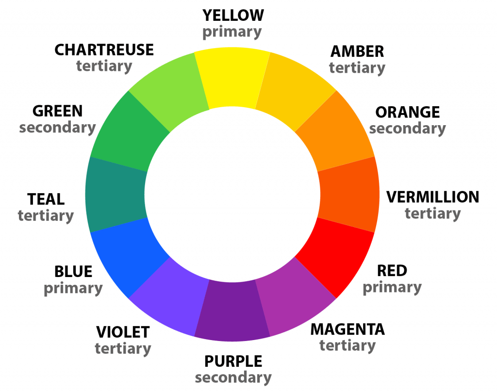

# Introduction

This report we are going to discuss colour theory. we will be looking in depth at primary, secondary and tertiary colour
pallet, including shades, tints and tones. We will look at how these colours can be combined to create different colour
harmonies and investigate further some of these harmonies, for example, Monochromatic, Complementary and Harmonious
colour scheme.

```SOMETHING ABOUT THE DIFFERENCE OF LIGHT AND PAINT COLOUR```

# Colours

Colours are made up of every hue, tone, tint and shade possible, therefore leading to these words being used
interchangeably.

Colours have a very import aspect in the world. When colours are used properly, it can lead to physical and even
psychological changes to the human body, such as, higher blood pressure or suppression of appetite, it does not only,
plays a big part on the human body it also can be used as a powerful form of communication, a very common example are
traffic lights, with its use of red and green to mean 'stop' and 'go' respectively, red and green has now become a
worldwide definition for 'go' or 'stop' [1](https://www.colormatters.com/).

## Hue

Hue refers to the dominant color family, these are visible colours, mainly primary, secondary and even tertiary colour
in the colour wheel.



### Primary

Primary colours are the root of any other colours and can't be created by mixing other colours
(2)[https://www.bbc.co.uk/bitesize/guides/z3bqycw/revision/2]. These colours are red, blue and yellow, and by them
equally you will get black. They seat 120 degrees apart on the colour wheel, with yellow at 0 degrees (or 360), as seen
from picture [Colour Wheel].

### Secondary

A mix of equal amounts of two primary colours will make a secondary colour, which are purple (blue and red), orange (
yellow and red) and green (blue and yellow) (3)[https://www.bbc.co.uk/bitesize/guides/z3bqycw/revision/3]. The secondary
colours seats halfway between the two primary colours is it made from on the colour wheel. You can see this from the
picture [Colour Wheel].

### Tertiary

A mix of equal amount of a primary and secondary colour seating adjacent to each other on the colour wheel makes a
tertiary colour, the new colour will then seat between colours it was composed from. There are 6 different tertiary
colours, which are amber (orange and yellow), vermilion (red and orange), magenta (red and purple), violet (blue and
purple), teal (green and blue) and chartreuse (yellow and green)
(4)[https://www.bbc.co.uk/bitesize/guides/z3bqycw/revision/4].

## Tints, Tones and Shades

A tint is a lighter version of a dominant colour. To make a tint colour first you got to add it white, then a dominant
colour, the amount of white defines the brightness of the tint. For example, pink is not a dominant colour, it just a
tint of red (5)[https://www.bbc.co.uk/bitesize/guides/z3bqycw/revision/9]. All pastel colours are generally a tinted
colour (6)[https://www.beachpainting.com/blog/color-hue-tint-tone-and-shade/].

A tone is a mix of dominant colours with grey, just be careful not to mix too much grey because the colour will turn
over-dulled and is irreversible, to make grey you just need to mix the same amount of black and white
(6)[https://www.beachpainting.com/blog/color-hue-tint-tone-and-shade/].

A shade is a mix of dominant colours with black, first add the dominant colour then gradually add black
(6)[https://www.beachpainting.com/blog/color-hue-tint-tone-and-shade/]. Black and white are not technically colours,
they are simple shades and tints (7)[https://www.adobe.com/uk/creativecloud/design/discover/is-black-a-color.html].


# Conclusion

It has become a very import part in the world. Giving different means to things, depending on how its used.
