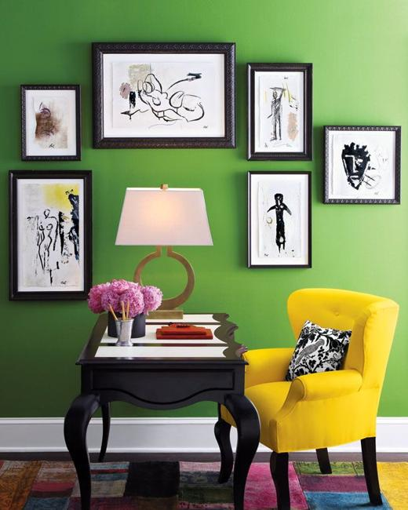
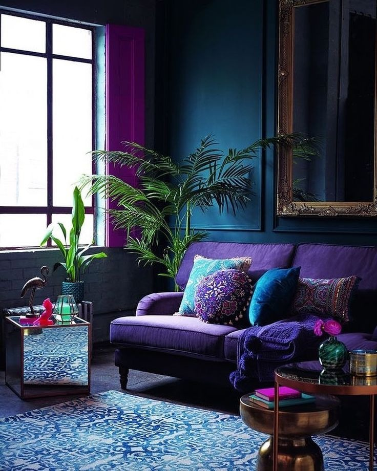

# Monochromatic

Monochromatic is a very simple and easy colour scheme to create, it just one dominant colour that varies in tints, tones
and shades. This creates focus, attracts attention and support
legibility [1](https://en.wikipedia.org/wiki/Color_scheme).

# Complementary

Complementary are the color opposite each other on the color of wheel,also they cancel it other.
https://www.tigercolor.com/color-lab/color-theory/color-harmonies.htm

# Harmonious Colours

Harmonious color scheme also known as Analogous Colours, are normally inspired by nature. They can have two sets, a
three colours set, and a 5 colours set, the colours on these sets, stands next to each other on the colour wheels, this
creates harmony between the colours in such a way that none of the colours are the main focus of the
design [2](https://www.bbc.co.uk/bitesize/guides/z9bbk2p/revision/6). Some example of these sets are:

Three colours set:

- yellow
- green-yellow
- green

Five colours set:

- Blue-green
- Blue
- Blue-purple
- Purple
- Red-purple

# Psychological

Thousands years ago the Egyptians studied the psychology of the color, how they affect the mood and behaviours, and it
was commonly used for holistic benefits [3](https://ethos3.com/2014/06/the-history-of-color-psychology/) .

## Red

The psychological benefits of Red are sexuality, warm, vibrant, energizing, powerful, impulsive, charming, charismatic
and radiant. It can also effect your body directly by boosting your self-esteem, and opens your appetite.

The psychological disadvantages are anger, revenge, danger, violence. It also affects the body physically by increased
heart and the respiratory.
rates [4](https://www.empower-yourself-with-color-psychology.com/color-red.html#:~:text=The%20Color%20Red,their%20red%20car)
.

Commercially, red is used a lot in restaurants to help increase their costumers appetite, not only can it be used to
bring desire, it is commonly used for communications, such as, traffic lights and signs to show you the hazard.

## Blue

Opposed to Red, Blue colour can lower our heart rates, blood pressure and body temperature by effecting your pituitary
glands and slowing our breathing [5](https://www.sensationalcolor.com/meaning-of-blue/).

In a psychology perspective, blue represents responsibility, reliability, security, confidence, honesty, loyalty,
sincerity, reservation, quietness, idealism, self-expressionism, trust and order.

Its negative aspects include, rigidness, deceitful, spiteful, depression, sadness, passivity, self-righteousness,
superstition, emotionally unstable, conservative, old-fashioned, predictable, weak, unforgiving, detached, manipulative,
unfaithfulness, untrustworthy.
