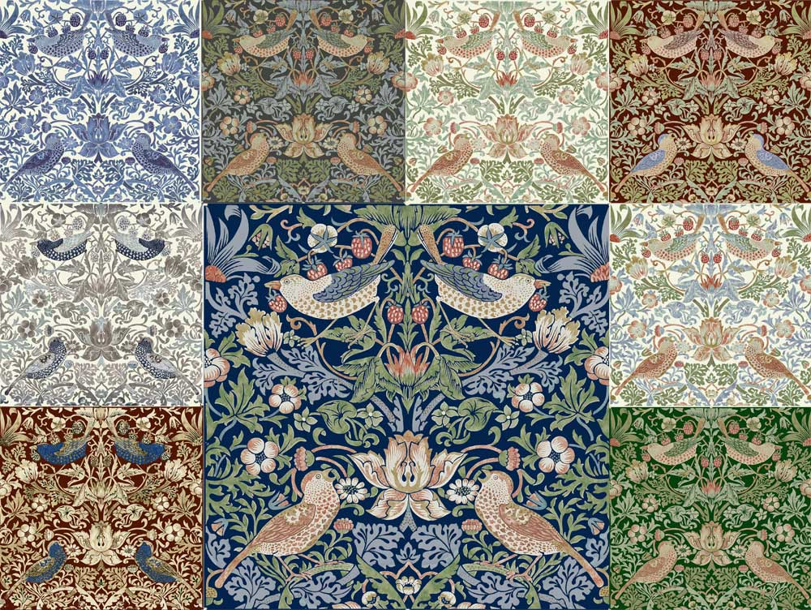

# Introduction

We are going to talk about the 'Strawberry Thief' fabric, as well as the history of this pattern, when it was made,
where it was made and its uses. We will be discussing the historical period that it was part of and its creator.

# Strawberry Thief

Created during the Art and Crafts Era by William Morris. It is one of Morris most popular repeating designs. It was
creates by the inspiration of a thrushes that he found stealing strawberries under his fruit nets at his countryside
home, Kelmscott Manor, is Oxfordshire [1](https://www.britannica.com/biography/William-Morris-British-artist-and-author)
. Although he couldn't draw birds, all his designs with birds are draw by his friend Philip Webb
[2](https://mymodernmet.com/arts-and-crafts-movement-william-morris/2/).

This fabric uses a complex technique that is called Indigo-discharge. It's a formula for creating dyes out of vegetable,
he created the colours "blue from indigo and woad; red from the insects kermis and cochineal and the plant madder;
yellow from the weld, poplar, osier, birch, broom and quercitron; brown from walnut tree roots."
[3](https://www.laurasbeau.co.uk/news-and-blog/william-morris/william-morris-the-indigo-discharge-dye-technique/). This
was a long process it took three days to complete entirely and was the most expensive fabric sold by Morris company,
Morris & Co, which is still active to date and is now part of Sanderson Design Group
[4](https://sandersondesign.group/our-brands/morris-co/). Despite its price it became a very successful pattern
commercially. The process was soo laborious that William Morris attempted this method 1875 and was only successful later
in 1881, he then stated to his daughter in 1883 "I was a great deal at Merton last week... anxiously superintending the
first printing of the Strawberry thief, which I think we shall manage this time." when the fabric was finally completed.
[5](https://collections.vam.ac.uk/item/O78889/strawberry-thief-furnishing-fabric-morris-william/).

This fabric is rich in animal and flower patterns whilst bluebell and Marigold use a stencilled design in variety of
muted colours. With its symmetry and intricate tapestry-style designs it has a timeless look.
[6](https://www.housedecorinteriors.co.uk/fabrics/mor220313_strawberry_thief_fabric_indigo_mineral_william_morris_and_co_archive_prints_collection/#.YONtJ0lKiDI)
.

The Morris & Co. generally used wool for most of its designs, despite this cotton was chosen for this design, intended
to be used for interior decoration, such as, curtains, drapes and loose covers on furniture
[7](https://en.wikipedia.org/wiki/Strawberry_Thief_(William_Morris)).

Available colours are: Butter Cream, Forest, White, Indigo, Rooster Comb Red, Victorian Blue, Jet, Slate Gray, Wine, Sky
and Dragons Blood. [8](https://williammorristile.com/textiles/strawberry_thief_background_colors.html).

# Art and Crafts Era

The art and craft movement start in Britain, by William Morris at the end of the 19th century and beginning of the 20th
century. [9](https://www.vam.ac.uk/articles/arts-and-crafts-an-introduction). Reflected in the reminiscent of decoration
style at medieval times. [10](http://www.designishistory.com/1850/arts--crafts/). Woodblock-printed wallpaper designs
was used throughout those times and are still in use today for stamping ceramics, curtains, furniture and upholstery all
over the world [11](https://mymodernmet.com/arts-and-crafts-movement-william-morris/2/).

Some architects, designers, sculptor and painters joined-up the art and crafts approach to design and spread to America
and Europe eventually Japan too.

# Willian Morries

Willian Morries born on 24th March 1834 in Walthamstow, East London in
England. [12](https://mymodernmet.com/arts-and-crafts-movement-william-morris/) He was also a poet, artist, philosopher,
typographer, political theorist, and arguably the most celebrated designer of the Arts & Crafts movement inspired by the
nature, elegant curl of vines, leaves, flowers and fruit tree
branches [13](https://www.artyfactory.com/graphic_design/graphic_designers/william_morris.html). William brought back
handmade production to his designs after the Industrial Revolution, he had created the most famous fabrics pattens on
the 19th century, including the 'Strawberry Thief' design. His was an inspiration for painters, designers, architects
and sculptor at that time and still is, as some contemporary arts are inspiration by Morris way, like David Mabb and
Jeremy Deller [14](https://www.theartstory.org/artist/morris-william/life-and-legacy/).

William Morris work was reproduced internationally and it also inspired the North-America Arts & Crafts Movement, Art
Nouveau in France and Mingei in Japan.
